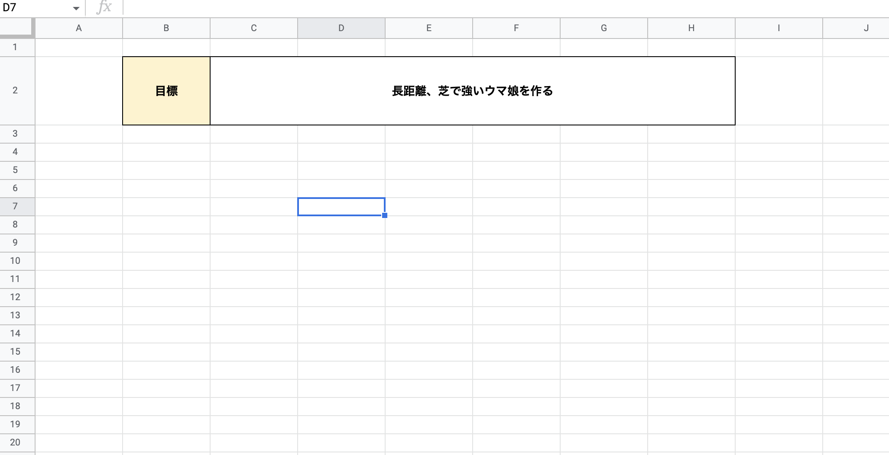
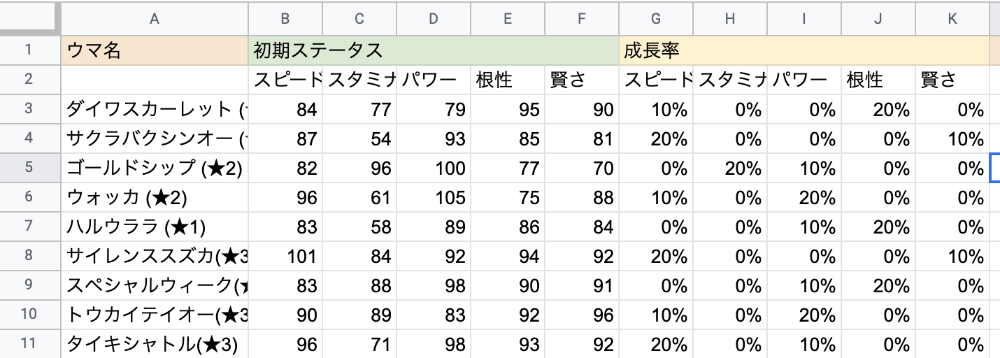
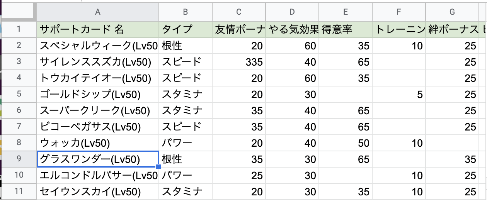
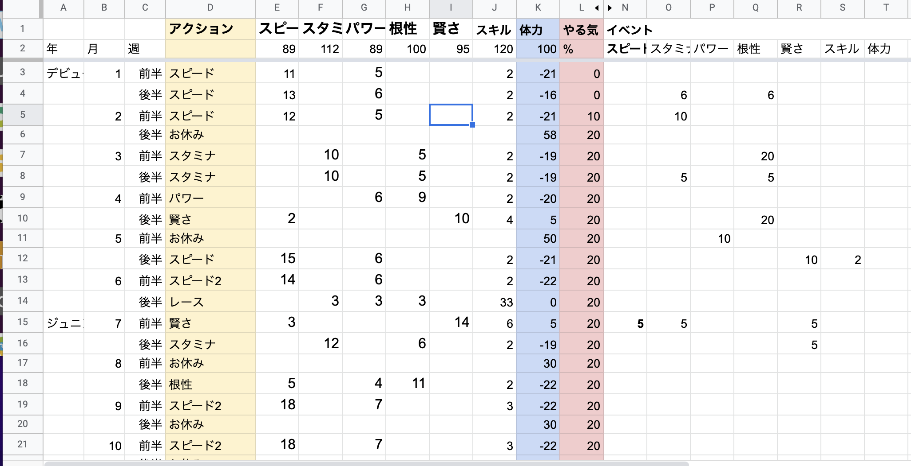

# データサイエンス課題１

今回から、ウマ娘を用いて実際にデータサイエンスの流れに沿って作業をしてむたいと思います。


データサイエンスの一般的な作業の流れはどのようになっているのかという話は、すでに講義の中で説明されている通りですが、今回のウマ娘を用いたデータサイエンスでは以下の目的と流れで作業していきましょう。


＜目標＞

```
ウマ娘のデータを収集し、ウマ娘、サポートカード、練習の組み合わせで、どのようなウマ娘が育つかを予測するモデルを作成し評価する。

強いウマ娘を育てる方法を仮説を立てて検証。
```


＜全体の流れ＞

① 目標設定

② データ収集

③ Excel内で関数を用いてデータを加工,集計

④ (モデル作成)シュミレータの作成

⑤ (評価)作成したモデル通りにウマ娘が成長するかテストする。


## 課題 目標設定

チームの目標を決めましょう。

```
ウマ娘のデータを収集し、ウマ娘、サポートカード、練習の組み合わせで、どのようなウマ娘が育つかを予測するモデルを作成し評価する。

強いウマ娘を育てる方法を仮説を立てて検証。
```

- 強いウマ娘の定義を決める

距離は？
- 長距離
- 中距離
- マイル
- 短距離

芝orダート？
- 芝
- ダート

その他：
- 〇〇の条件で強い


① まずは、今回使用するExcelファイルを作成しましょう。ファイル名を「**ウマ娘最終課題_自分の名前**」とする。

目標のシートを作り、そこに目標を記載しなさい。





## 課題１(データ収集)


以下の３つのデータを収集しなさい。

- ウマ娘のデータ
- サポートカード
- 育成データ

収集したデータはExcelファイルにまとめてください。

　　
  　
   
  
 
② 先ほど作ったファイルに、次に今回使用するシートを作成していきましょう。

「ウマ娘のデータ」「サポートカード」「育成データ」の３つのシートを作成してください。


③ 実際に以下のデータを集める。


- 「ウマ娘のデータ」

  強いウマ娘を育てるためのウマ娘データを収集。
  
  課題１のような初期ステータスをまとめる
  
 




- 「サポートカード」

  強いウマ娘を育てるために必要なサポートカードデータを収集。
  
  課題２のようにカードを情報をまとめる




- 「育成データの収集」
   
    トレーニングした内容、トレーニングした回数、強化される値をまとめる。
    
    また、イベントでの能力の変化の値も集計できたら尚良い。




評価ポイント
- 目標が明確に定まっている（必須）
- 
- ウマ娘のデータの収集において、目標に沿ったデータ量が十分に収集されている。(必須)
- サポートカードのデータの収集において、目標に沿ったデータ量が十分に収集されている。(必須)
- 育成データ収集において、トレーニングによるステータスの変化のデータを収集できている。(必須)
- 育成データ収集において、イベント等によるステータスの変化のデータが収集できている。（＋α）


