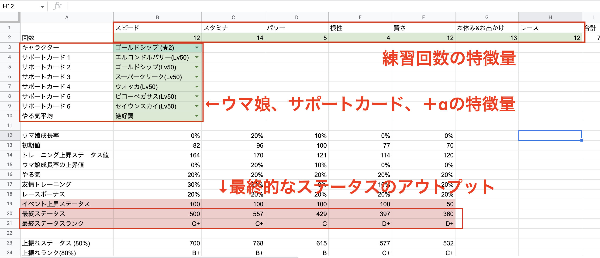

# データサイエンス課題2

シミュレーションのデータモデルを作成しましょう。

## 特徴量の選択

取得したデータからどのようなステータスのウマ娘ができるかを予測するモデルを作成します。

　データのモデルを作るために特徴量を選択します。

　
 **最低限の特徴量は、以下の情報を使うこと**
 
 - ウマ娘の初期ステータス
 - サポートカードの情報
 - それぞれの練習回数
 
 　 
　他にもシミュレーションの精度を上げるデータがあれば使用しても良い（**加点ポイント**）
 
 
## 課題２（シミュレーションモデルの作成）

上記の特徴量を使って、Excelを使ってシミュレーションデータを作成します。

①シート名を「シミュレーションモデル」を作成しましょう。

特徴のインプットをもとに、最終的なウマ娘のステータスが表示されるExcelを完成させなさい。

（参考イメージ）

※以下の表はあくまでサンプルです。

評価ポイント
- 最低限の特徴量を扱えている（必須）
- 特徴量＋αについて考えている（＋α）
- シミュレーションのモデルが作成されている（必須）
- 関数を使ってシミュレーションが動的に変わる（必須）
- シミュレーションの精度を上げる工夫がされている（＋α）

