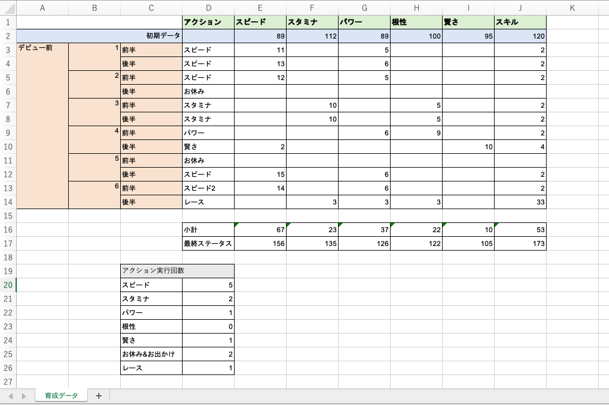

# Excelの基礎2
今回は、Excelでよく使われる"関数"という機能を使ってみましょう。

## 関数とは
Excelは表の作成を便利にするとともに、計算も簡単にしてくれる機能が付いています。それが関数です。
合計、平均、数値の比較など、対象となる数がどれだけ大量にあっても一瞬で計算してくれて、データを扱う上では欠かせない技術になるのでしっかり身につけてください。

## 動画で学ぼう
では、実際に関数を使っていきたいと思いますが、注意してほしいことが数点あります。動画を見るのと同時に以下の作業も並行して行うようにしてください。
- 動画内で例として書いているものは全て真似して書いてください。
- 関数は書き方(公式のようなもの)が決まっています。下の例のように自分なりにわかりやすくまとめるようにしてください。 
    例.
      合計 → SUM  式の例: SUM(A1,A2,A3) または SUM(A1:A3)
  参考サイトとして以下を掲載しておきます。 
    [https://dekiru.net/article/4429/](https://dekiru.net/article/4429/)

それでは、動画を見ていきましょう。 
[https://youtu.be/kHznR_lrcW4](https://youtu.be/kHznR_lrcW4)

## 保存
最後に、作成したExcelファイルは次回も使用するので必ず保存してください。
初めてこのファイルを保存する人は
- 保存する際の名前「Excel基礎.xlsx」
- 保存先「document > クラーク > データサイエンス」 
既に一度 "名前をつけて保存" している人は "上書き保存" してください。

## 課題(動画内の課題とは別です)
  今回は実際にウマ娘を育成してみて、育成データをまとめていきたいと思います。
  データサイエンスにおいて、実際にデータを収集する力とデータを分かりやすく使いやすくまとめる技術は、分析する技術と同じくらい大事なものです。今回はそのような技術を養ってください。

  (課題) Excelのシートで以下のような「育成データ」を作りなさい。

- 初期データの行には自分のウマ娘の初期データを入力しなさい。
- アクションの列には各ターンで実行したトレーニング名を入力しなさい。
- スピード〜スキルの列にはトレーニングした時に上がった数値を入力しなさい。
- 小計の行にはそれぞれ3行目から14行目の合計値を関数を使って入力しなさい。
- 最終ステータスには小計と初期データを足し合わせたものを関数または数式を使って表示しなさい。
- 20行目〜26行目はアクションの実行回数です。関数を使ってそれぞれの実行回数を表示させなさい。 
  (ヒント)
    この画像内では「COUNTIF」という関数を使っています。使う関数は様々候補があるので調べてみて自分の好きな関数を使ってください。 
