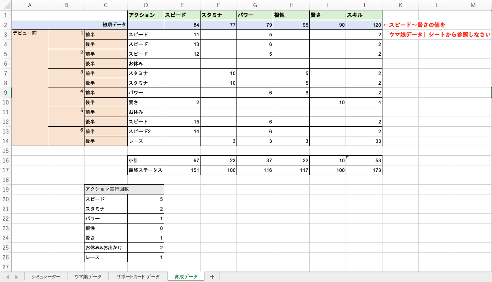
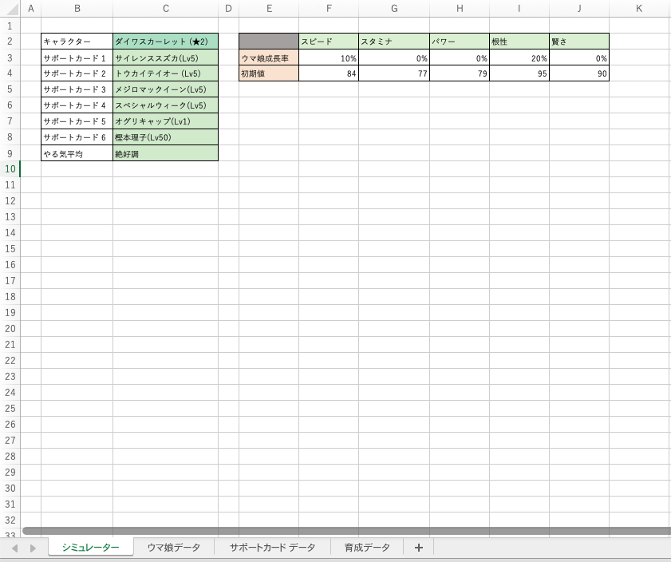

# Excelの基礎3
今回はExcelを作成していく上で便利な「値の参照」「ドロップダウンリストの作成」、データを扱う上で大事な「フィルター機能」や「VLOOKUP関数」という機能を学習していきましょう。

## 動画で学ぼう
今回は早速動画での学習に入っていきましょう。今回から少しずつ難しい操作が出くるので、ゆっくり動画を止めながら進めてください。
  参考サイトとして以下を掲載しておきます。参考資料として読むと理解が深まります。 
    
  - ドロップダウンリストの作成について 
    [https://www.pc-koubou.jp/magazine/38812](https://www.pc-koubou.jp/magazine/38812) 
  - VLOOKUP関数について 
    [https://dekiru.net/article/21009/](https://dekiru.net/article/21009/) 
  - VLOOKUP関数でどんなときに第４引数にTRUEをいれるのか 
    [https://blog02.aqua-school.com/2019/08/24/excel-45/](https://blog02.aqua-school.com/2019/08/24/excel-45/)

それでは、動画を見ていきましょう。 
[https://youtu.be/VoM-ZqmHRvY](https://youtu.be/VoM-ZqmHRvY)

## 保存
最後に、作成したExcelファイルは次回も使用するので必ず保存してください。
初めてこのファイルを保存する人は
- 保存する際の名前「Excel基礎.xlsx」
- 保存先「document > クラーク > データサイエンス」 
既に一度 "名前をつけて保存" している人は "上書き保存" してください。

## 課題(動画内の課題とは別です)
  ※ これまでの課題が終わっていない人はそちらを優先しましょう。 

  (課題) 以下のシートを作成しなさい 

 

- 「育成データ」シートの初期データのスピード〜賢さを「ウマ娘データ」シートから参照するようにしなさい。 

 

- 上の画像のような「シュミレータ」シートを作成しなさい。 
- C2〜C8の値は「ウマ娘データ」と「サポートカードデータ」のキャラクター名をデータとするドロップダウンリストを作成しなさい。 
- F3〜J4の表は、VLOOKUP関数を用いてキャラクター名を変更すると値が変更されるようにしなさい。 

<iframe width="560" height="500" src="https://www.youtube.com/embed/RDgteDS4hGk" title="YouTube video player" frameborder="0" allow="accelerometer; autoplay; clipboard-write; encrypted-media; gyroscope; picture-in-picture" allowfullscreen></iframe> 

