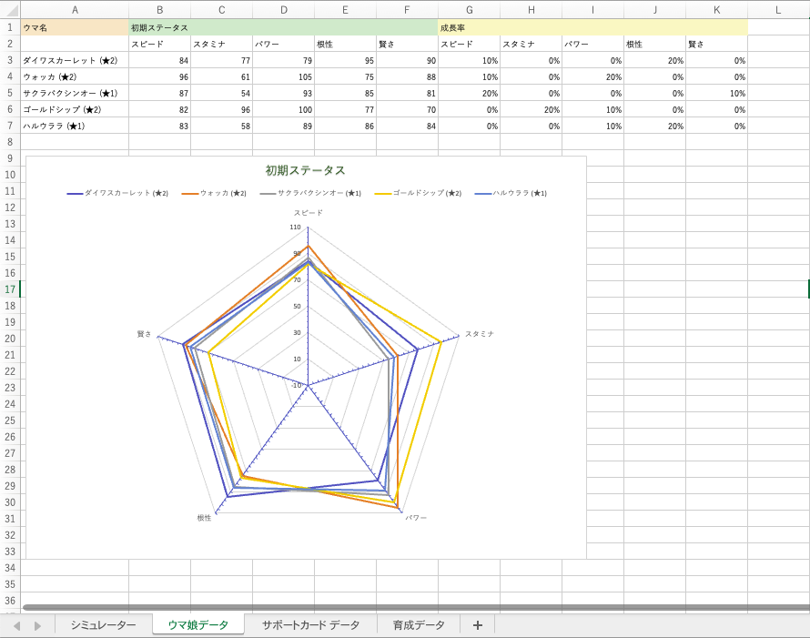
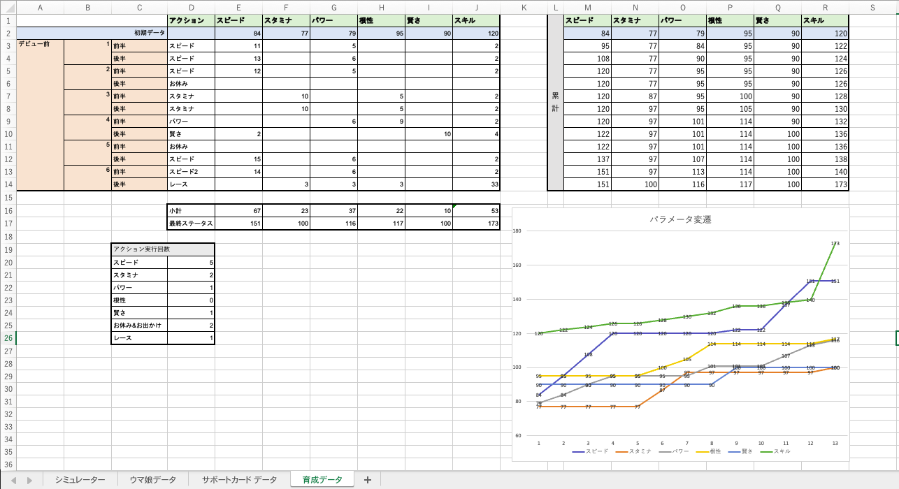

# Excelの基礎４
今回はExcelでのグラフの作成の仕方について学んでいきたいと思います。
データを分かりやすく表現するためにはグラフで見せるという手法は外せない選択肢だと思うのでしっかり身につけてください。

## 動画で学ぼう
今回少し注意してもらいたいのは、Macとwindowsの操作感の違いです。動画内ではMacを使用して解説しているためWindowsの表示とは少し違うところも出てくるかもしてません。その際は動画を止めて調べながら進めてください。 

それでは、動画を見ていきましょう。 
[https://youtu.be/Qr6KHwz56Do](https://youtu.be/Qr6KHwz56Do) 

今回は動画内の課題は無いので下の課題に進んでください。

## 保存
最後に、作成したExcelファイルは次回も使用するので必ず保存してください。
初めてこのファイルを保存する人は
- 保存する際の名前「Excel基礎.xlsx」
- 保存先「document > クラーク > データサイエンス」 
既に一度 "名前をつけて保存" している人は "上書き保存" してください。

## 課題
  ※ これまでの課題が終わっていない人はそちらを優先しましょう。 

  (課題) 以下のグラフを作成しなさい 

 

- 上の図のように「ウマ娘データ」シートの初期データをデータチャートグラフにしなさい。 

 

- 上の図のように「育成データ」のスピード〜スキルまでのパラメータの変遷を折れ線グラフで表しなさい。 

